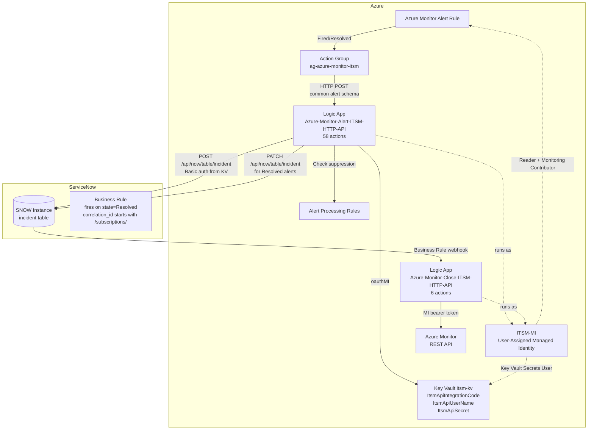

# Architecture

## Overview

This solution provides bi-directional integration between Azure Monitor and ServiceNow using two Logic Apps sourced from [John Joyner's open-source templates](https://github.com/john-joyner/Microsoft.Logic).

## Component Diagram



## Authentication Flow

```
┌──────────────────┐     oauthMI API connection     ┌─────────────────┐
│  Logic App       │ ──────────────────────────────► │  Key Vault      │
│  (runs as MI)    │                                  │  itsm-kv        │
└──────────────────┘                                  └─────────────────┘
         │                                                     │
         │  MI bearer token                                    │  Returns SNOW secrets
         ▼                                                     ▼
┌──────────────────┐                           ┌──────────────────────────┐
│  Azure Monitor   │                           │  ServiceNow Table API    │
│  REST API        │                           │  Basic auth at runtime   │
└──────────────────┘                           └──────────────────────────┘
```

**Key principle: No SPN, no user credentials, no client secrets on the Azure side.**

## Data Flow: Alert → SNOW Incident

1. Azure Monitor fires an alert (Metric, Log, Activity Log)
2. Action Group sends the alert payload (common alert schema) to Logic App 1 via HTTP POST
3. Logic App 1 reads SNOW credentials from Key Vault using ITSM-MI
4. Logic App 1 checks Azure Monitor Alert Processing Rules for suppression
5. If **Fired** and not suppressed: POST to `/api/now/table/incident` → new SNOW incident
   - `short_description` = alert rule name + description
   - `correlation_id` = Azure Monitor `alertId` (e.g., `/subscriptions/.../alerts/{guid}`)
   - `impact` / `urgency` / `priority` = mapped from Azure severity (Sev0-4)
6. If **Resolved**: PATCH to `/api/now/table/incident/{sys_id}` → close SNOW incident

## Data Flow: SNOW Close → Azure Monitor Close

1. SNOW agent resolves the incident (state = Resolved / Closed)
2. SNOW Business Rule detects: `correlation_id` starts with `/subscriptions/`
3. Business Rule POSTs to Logic App 2 webhook
4. Logic App 2 extracts the `alertId` from `correlation_id`
5. Logic App 2 calls Azure Monitor REST API (using ITSM-MI) to close/acknowledge the alert

## Severity Mapping Table

| Azure Sev | Monitor Condition | SNOW Impact | SNOW Urgency | SNOW Priority |
|---|---|---|---|---|
| Sev0 | Critical | 1 – High | 1 – High | 1 – Critical |
| Sev1 | Error | 1 – High | 2 – Medium | 2 – High |
| Sev2 | Warning | 2 – Medium | 2 – Medium | 3 – Moderate |
| Sev3 | Informational | 3 – Low | 3 – Low | 4 – Low |
| Sev4 | Verbose | 3 – Low | 3 – Low | 5 – Planning |

## Key Vault Secrets

| Secret Name | Value | Purpose |
|---|---|---|
| `ItsmApiIntegrationCode` | `https://{instance}.service-now.com` | SNOW instance base URL |
| `ItsmApiUserName` | SNOW service account username | Basic auth credential |
| `ItsmApiSecret` | SNOW service account password | Basic auth credential |

## ITSM-MI RBAC Assignments

| Role | Scope | Purpose |
|---|---|---|
| Reader | Subscription | Read alert target resources |
| Monitoring Contributor | Subscription | Update alert states |
| Key Vault Secrets User | Key Vault (`itsm-kv`) | Read secrets at runtime |

## Logic App ARM Templates

Both Logic Apps are deployed from John Joyner's open-source ARM templates:
- [Azure-Monitor-Alert-ITSM-HTTP-API.json](https://github.com/john-joyner/Microsoft.Logic/blob/main/Integrate-Azure-Monitor-alerts-with-your-ITSM-Solution/Azure-Monitor-Alert-ITSM-HTTP-API.json) (110KB, 58 actions)
- [Azure-Monitor-Close-ITSM-HTTP-API.json](https://github.com/john-joyner/Microsoft.Logic/blob/main/Integrate-Azure-Monitor-alerts-with-your-ITSM-Solution/Azure-Monitor-Close-ITSM-HTTP-API.json) (20KB, 6 actions)

Both templates are stored in `src/arm/` and deployed as nested deployments from Bicep and Terraform.

The Logic Apps deploy in **Disabled** state (John's zero-trust design). Run `Enable-LogicApps.ps1` after all prerequisites are configured.
