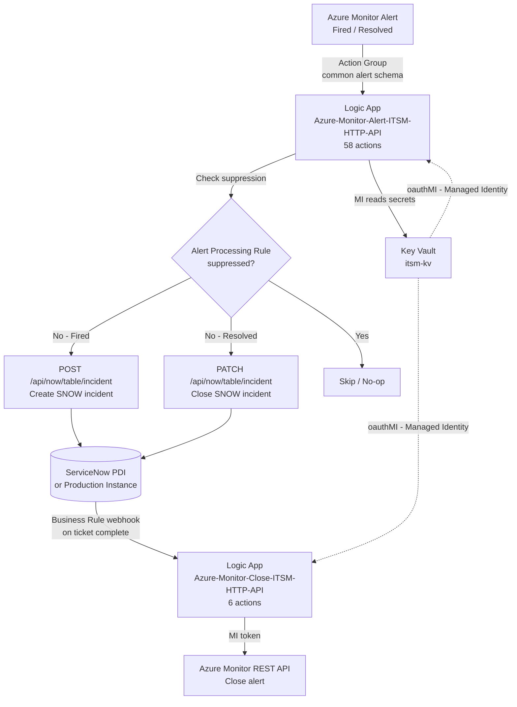

# Azure Monitor → ServiceNow Integration

> **A fully automated, repeatable solution connecting Azure Monitor alerts to ServiceNow.**  
> Based on [John Joyner's (Microsoft MVP) detailed guide](https://blog.johnjoyner.net/integrate-azure-monitor-alerts-from-servers-with-your-itsm-system/) — replaces the deprecated Azure Monitor ITSM Connector marketplace item.

---

## Architecture



### Auth Strategy: Managed Identity Only

| Scenario | Method |
|---|---|
| Logic App → Key Vault | User-Assigned MI (`oauthMI` API connection) |
| Logic App → Azure Monitor REST API | User-Assigned MI bearer token |
| SNOW credentials in Azure | Stored in Key Vault only — never in code or templates |

---

## Quick Start

### Prerequisites

- Azure subscription with Contributor access
- PowerShell 7+, Azure CLI (with Bicep), or Terraform ≥ 1.5
- ServiceNow instance (or free [PDI](https://developer.servicenow.com)) with admin access

### One-command deploy (Bicep)

```powershell
# Clone repo
git clone https://github.com/thisismydemo/azure-monitor-itsm
cd azure-monitor-itsm

# Full deployment (prompts for SNOW password)
.\deploy\scripts\Deploy-Solution.ps1 `
  -ResourceGroupName rg-azure-monitor-itsm `
  -Location eastus `
  -SnowInstanceUrl https://dev123456.service-now.com `
  -SnowUsername azure_monitor_svc `
  -DeploymentMethod Bicep
```

### ServiceNow PDI (free dev instance)

```powershell
# Sign up at https://developer.servicenow.com then:
.\deploy\scripts\New-SnowPdiSetup.ps1 `
  -SnowInstanceUrl https://dev123456.service-now.com `
  -AdminUsername admin
```

---

## What Gets Deployed

| Resource | Name | Purpose |
|---|---|---|
| User-Assigned MI | `ITSM-MI` | All Azure-side auth (no SPN) |
| Key Vault | `itsm-kv` | Stores SNOW URL, username, password |
| KV API Connection | `itsm-keyvault-connection-mi` | Logic App → KV via `oauthMI` |
| Logic App (Alert) | `Azure-Monitor-Alert-ITSM-HTTP-API` | Azure Monitor → SNOW incident |
| Logic App (Close) | `Azure-Monitor-Close-ITSM-HTTP-API` | SNOW close → Azure Monitor |
| Action Group | `ag-azure-monitor-itsm` | Triggers Alert Logic App |

---

## Deployment Scripts

| Script | Purpose | John's Step |
|---|---|---|
| `Deploy-Solution.ps1` | Full orchestrator (calls all scripts) | All |
| `New-Prerequisites.ps1` | ITSM-MI, RBAC, KV API connection | 1, 5 |
| `Set-KeyVaultSecrets.ps1` | Key Vault creation + SNOW secrets | 3, 4 |
| `Set-KeyVaultFirewall.ps1` | Restrict KV to Logic App outbound IPs | 7 |
| `New-ActionGroup.ps1` | Create Action Group | 10 |
| `Enable-LogicApps.ps1` | Enable both Logic Apps | 14 |
| `Test-Integration.ps1` | End-to-end smoke test | — |
| `New-SnowPdiSetup.ps1` | SNOW PDI setup (user, roles, test API) | — |

---

## IaC Options

=== "Bicep"

    ```powershell
    .\Deploy-Solution.ps1 -ResourceGroupName rg-azure-monitor-itsm `
      -SnowInstanceUrl https://... -SnowUsername azure_monitor_svc `
      -DeploymentMethod Bicep
    ```

=== "Terraform"

    ```powershell
    .\Deploy-Solution.ps1 -ResourceGroupName rg-azure-monitor-itsm `
      -SnowInstanceUrl https://... -SnowUsername azure_monitor_svc `
      -DeploymentMethod Terraform
    ```

=== "ARM"

    ```powershell
    .\Deploy-Solution.ps1 -ResourceGroupName rg-azure-monitor-itsm `
      -SnowInstanceUrl https://... -SnowUsername azure_monitor_svc `
      -DeploymentMethod ARM
    ```

---

## Severity Mapping

| Azure Monitor | SNOW Impact | SNOW Urgency | SNOW Priority |
|---|---|---|---|
| Sev0 – Critical | 1 – High | 1 – High | 1 – Critical |
| Sev1 – Error | 1 – High | 2 – Medium | 2 – High |
| Sev2 – Warning | 2 – Medium | 2 – Medium | 3 – Moderate |
| Sev3 – Informational | 3 – Low | 3 – Low | 4 – Low |
| Sev4 – Verbose | 3 – Low | 3 – Low | 5 – Planning |

---

## References

- 📖 [John Joyner's blog post](https://blog.johnjoyner.net/integrate-azure-monitor-alerts-from-servers-with-your-itsm-system/) — primary reference
- 📦 [John's ARM templates](https://github.com/john-joyner/Microsoft.Logic/tree/main/Integrate-Azure-Monitor-alerts-with-your-ITSM-Solution)
- 🔗 [ServiceNow PDI](https://developer.servicenow.com) — free dev instance
- 📚 [Azure Monitor common alert schema](https://learn.microsoft.com/azure/azure-monitor/alerts/alerts-common-schema)
- 📚 [ServiceNow Table API](https://developer.servicenow.com/dev.do#!/reference/api/latest/rest/c_TableAPI)
