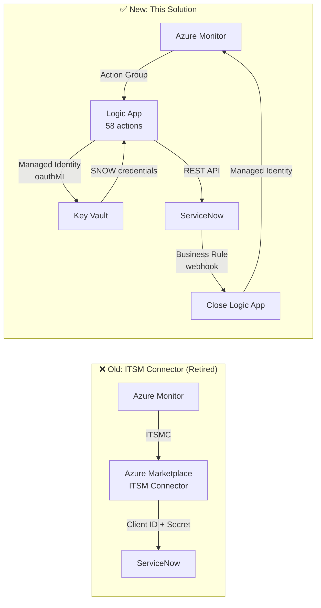

# Why Not the Azure Monitor ITSM Connector?

> **TL;DR**: The Azure Monitor ITSM Connector (ITSMC) has been retired by Microsoft. This solution replaces it entirely using Logic Apps — a more flexible, supported, and Managed-Identity-capable approach based on [John Joyner's (Microsoft MVP) guide](https://blog.johnjoyner.net/integrate-azure-monitor-alerts-from-servers-with-your-itsm-system/).

---

## What Was the ITSM Connector?

The **IT Service Management Connector (ITSMC)** was an Azure Monitor feature available through the Azure Marketplace. It provided a direct bridge between Azure Monitor alerts and ITSM tools including:

- ServiceNow
- System Center Service Manager (SCSM)
- Provance
- Cherwell

It was configured through a Log Analytics workspace and used a **legacy OAuth client credential flow** (client ID + client secret) to authenticate to ServiceNow.

---

## Why Was It Retired?

Microsoft retired the ITSM Connector because:

| Reason | Detail |
|---|---|
| **Architecture debt** | Built on the old Log Analytics ITSM framework — not aligned with modern Azure Monitor capabilities |
| **No Managed Identity support** | Required client ID + secret — violates zero-trust principles |
| **Limited flexibility** | Fixed field mapping, no custom logic, no conditional routing |
| **Marketplace dependency** | Required a third-party marketplace item that added operational risk |
| **Logic Apps supersede it** | Azure Logic Apps with Managed Identity provide a better, fully supported alternative |

!!! warning "Official Retirement"
    Microsoft has officially retired the Azure Monitor ITSM Connector. Any existing ITSMC connections will stop working after the retirement date. Do not create new ITSMC connections — use this Logic App solution instead.

    For official retirement details, see the [Azure Updates](https://azure.microsoft.com/updates/) page and search for "ITSM Connector retirement".

---

## What This Solution Does Instead

This repo implements the approach recommended by **John Joyner (Microsoft MVP)** using native Azure Logic Apps with **Managed Identity** authentication — no marketplace item required, no client secrets.

### Key Differences

| | ITSM Connector (Retired) | This Solution |
|---|---|---|
| **Status** | ❌ Retired | ✅ Supported |
| **Auth** | Client ID + Secret | Managed Identity (oauthMI) |
| **SNOW record types** | Incident only | Incident, em_event, change_request, problem |
| **Custom field mapping** | Not supported | Full control in Logic App designer |
| **Conditional routing** | Not supported | 58-action Logic App with suppression, CI lookup |
| **Bi-directional sync** | Limited | Full (SNOW Business Rule → Close Logic App) |
| **IaC** | Portal only | Bicep, Terraform, ARM, Ansible |
| **Alert schema** | Legacy | Common Alert Schema (all alert types) |
| **Marketplace dependency** | Required | None |
| **Cost** | Included | Logic App consumption (~$0.000025/action) |

---

## Migration from ITSM Connector

If you have existing ITSMC connections, follow this sequence:

1. **Deploy this solution** in parallel (new resource group)
2. **Test** with a subset of alert rules using `Test-Integration.ps1`
3. **Update alert rules** to point to the new Action Group (`ag-azure-monitor-itsm`)
4. **Verify** SNOW incidents are being created correctly
5. **Remove** the old ITSMC connection from your Log Analytics workspace
6. **Delete** the old Marketplace item

!!! tip "Run in Parallel First"
    Do not remove the ITSMC connection until the new Logic App solution is verified end-to-end.
    Both can run simultaneously during the migration window.

---

## References

- [John Joyner's blog: Integrate Azure Monitor Alerts with Your ITSM System](https://blog.johnjoyner.net/integrate-azure-monitor-alerts-from-servers-with-your-itsm-system/)
- [Azure Logic Apps documentation](https://learn.microsoft.com/azure/logic-apps/)
- [Azure Monitor Action Groups](https://learn.microsoft.com/azure/azure-monitor/alerts/action-groups)
- [Common Alert Schema](https://learn.microsoft.com/azure/azure-monitor/alerts/alerts-common-schema)
